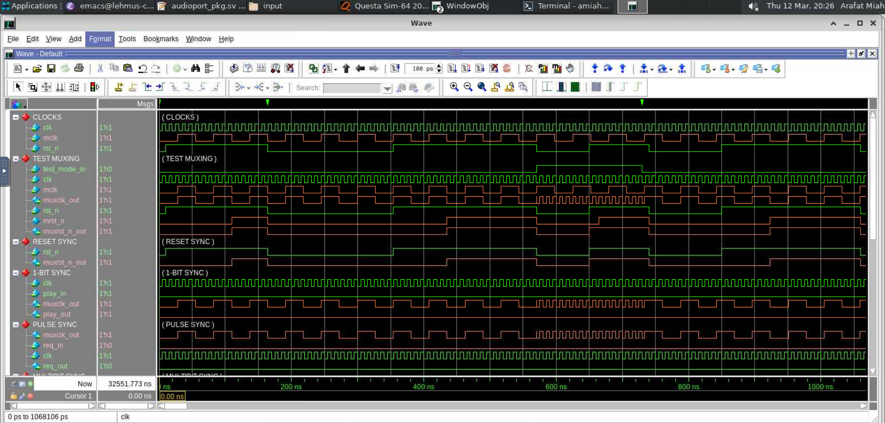
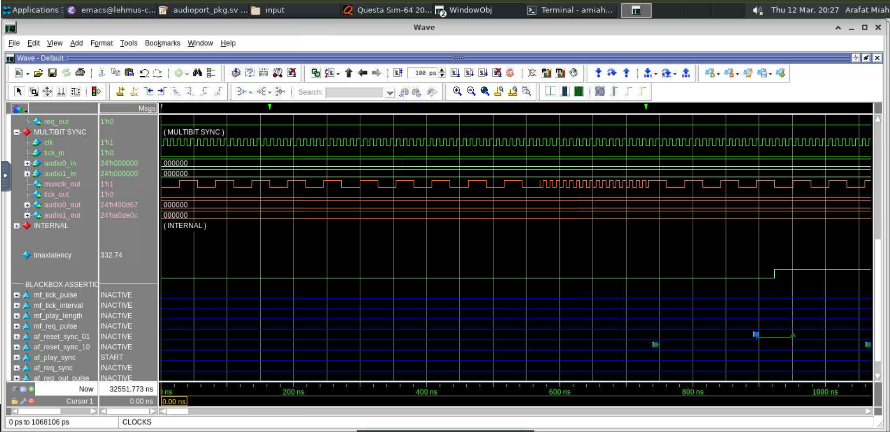

# CDC Unit RTL Design and Simulation (Lab 09)

## Repository
**Recommended name:** `Digital-Technique-3_Lab-09-CDC-RTL-Design`

## Overview
This repository contains the RTL implementation and functional simulation of a **Clock Domain Crossing (CDC) unit** developed for **Digital Technique 3 – Lab 09**. 

The goal of this lab was to design robust hardware synchronizers to safely transfer single-bit, pulse, and multi-bit signals between two asynchronous clock domains: a fast system clock (`clk` at 10.0 ns) and a slower audio clock (`mclk` at 54.2 ns). The design specifically prevents metastability failures that occur when signals cross asynchronous boundaries.

## Files Included
- `cdc_unit.sv` — The SystemVerilog RTL implementation containing all four synchronizer types (Reset, 1-Bit, Pulse, Multi-bit).
- `cdc_unit.sdc` — Synopsys Design Constraints defining the asynchronous clock domains and 1/8th period I/O delays.
- `play_sync_test.jpg` — Simulation waveform demonstrating the 1-bit 2-FF synchronizer resolving asynchronous transitions.
- `multibit_sync_sim_result.jpg` — Simulation waveform demonstrating the 4-phase FSM handshake for audio data.
- `Test _all_pass.jpg` — QuestaSim transcript confirming 100% pass rate (5/5 tests) and displaying calculated latencies.

---

## 9.1 RTL Architecture Description
The CDC unit utilizes four distinct industry-standard synchronization techniques based on the characteristics of the signals being transferred:

1. **Test Muxing:** Controlled by `test_mode_in` to seamlessly switch between functional clocks and test-mode clocks.
2. **Reset Synchronizer (`mrst_n_sff1`):** Uses an asynchronous-assert, synchronous-deassert structure to safely release the audio domain reset.
3. **1-Bit Synchronizer (`play_sff1`):** Uses a standard Two-Flip-Flop (2-FF) chain to safely pass the steady `play_in` signal into the `mclk` domain.
4. **Pulse Synchronizer (`req_sff1`):** Employs a 3-Flip-Flop edge detection circuit to safely pass wide `req_in` pulses into the fast `clk` domain.
5. **Multi-Bit Audio Sync (Handshake):** Implements a robust **4-Phase Handshake protocol** utilizing two Finite State Machines (TX and RX) to safely freeze, transfer, and acknowledge 48-bit stereo audio data across the domain boundary.

---

## 9.2 Functional Verification Results
The RTL design was functionally verified using a comprehensive testbench executing 5 specific test phases. 

- **Result:** PASSED (5 / 5 Tests)
- **Failures:** 0

The tests validated clock/reset switching (T1), asynchronous reset release (T2), single-bit metastability resolution (T3), edge detection (T4), and the complex multi-bit data handshake (T5). 

**Figure 9.1 — 1-Bit Synchronizer Waveform** 

**Figure 9.2 — Multi-bit Handshake Waveform** 

**Figure 9.3 — Simulation Transcript** 

---

## 9.3 Observations and Learning
### What I observed
- **Metastability and MTBF:** I observed firsthand why raw signals cannot simply be passed between asynchronous clocks. Implementing the 2-FF chain highlighted how adding intentional latency gives metastable signals a full clock cycle to settle to a stable digital value.
- **Protocol Overhead:** When observing the absolute latencies printed in the transcript, I noticed that the 4-phase audio handshake takes significantly longer (332.74 ns / 34 fast clock cycles) compared to a simple pulse sync (20.2 ns). This demonstrated the fundamental engineering trade-off between data safety and transmission latency.

### What I learned
- Developing the RTL code block-by-block (Testmux → Reset Sync → Pulse Sync → Handshake) was crucial. The most challenging aspect was correctly designing the FSMs for the 4-phase handshake to ensure data was strictly frozen in the TX register before asserting the `req` signal, and only unfreezing it once the `ack` signal completed the round trip.
- I gained a deep understanding of how to structure `always_ff` blocks for complex clock boundaries, specifically utilizing separate resets (`rst_n` vs `muxrst_n_out`) for different logical stages.

---

## Notes
I dedicated three consecutive days to developing the RTL code part-by-part to ensure the logic for the handshakes and synchronizers was physically sound. While I utilized AI as a supportive resource for report formatting and conceptual clarifications, the core RTL logic (`cdc_unit.sv`), architectural decisions, and verification execution were implemented entirely through my own independent effort.

## Author
Arafat Miah
